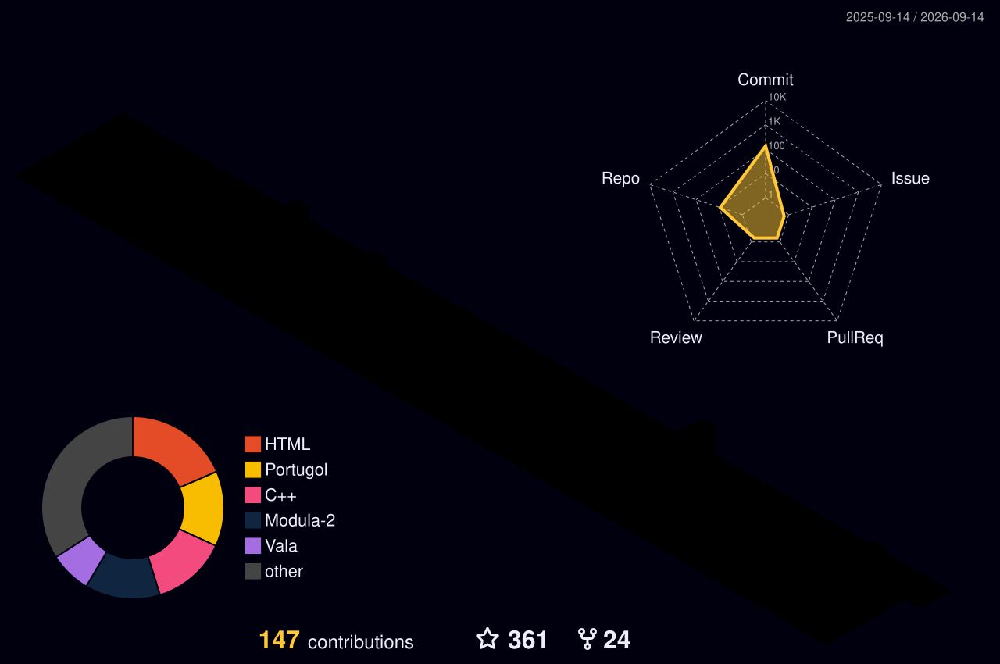

# José Augusto N. G. Manzano

**Professor · Autor · Pesquisador · Programador**

---

## Sobre

Professor e autor na área de **Ciência da Computação**, com atuação em programação de computadores, ensino e produção de material didático.

Este espaço reúne **códigos, exemplos, experimentos, projetos e materiais relacionados ao ensino e à prática de programação**, além de projetos desenvolvidos ao longo de diferentes períodos da evolução da computação.

A programação é aqui tratada não apenas como uma ferramenta de desenvolvimento, mas também como instrumento para compreender **algoritmos, linguagens, modelos de computação e fundamentos matemáticos da Ciência da Computação**.

---

## 📚 Livros e material didático

Grande parte dos projetos deste perfil está relacionada à produção de livros e materiais utilizados no ensino de programação.

### Algoritmos

**Algoritmos: Lógica para desenvolvimento de programação imperativa de computadores**

Material complementar, exemplos e implementações relacionados ao estudo de algoritmos, lógica de programação e resolução de problemas.

[→ `livro_Algoritmos_Logica`](https://github.com/J-AugustoManzano/livro_Algoritmos_Logica)

### Programação Funcional

**Algoritmos Funcionais**

Estudo de algoritmos sob a perspectiva do paradigma funcional, explorando funções, composição, recursão e transformação de dados.

[→ `livro_Algoritmos-Funcionais`](https://github.com/J-AugustoManzano/livro_Algoritmos-Funcionais)

### Assembly

**Introdução à Programação Assembly 8086**

Material destinado ao estudo da programação de baixo nível e da arquitetura do processador Intel 8086.

[→ `livro_Assembly-Intro-8086`](https://github.com/J-AugustoManzano/livro_Assembly-Intro-8086)

---

## 💻 Áreas de interesse

- Algoritmos e lógica de programação
- Paradigmas de programação
- Programação funcional
- Linguagens de programação
- Programação imperativa
- Programação de baixo nível
- Assembly
- Criptografia
- História da computação
- Fundamentos matemáticos da computação
- Educação em Computação
- Desenvolvimento de compiladores/interpretadores

---

## 🔎 Projetos em destaque

### λ Programação funcional

Projetos voltados ao estudo da programação funcional e das linguagens que contribuíram para a formação desse paradigma.

### 🧮 Algoritmos

Implementações utilizadas para explorar diferentes formas de expressar algoritmos e conceitos fundamentais de programação.

### 🖥️ Computação de baixo nível

Experimentos envolvendo Assembly, representação de dados, arquitetura de computadores e programação próxima ao hardware.

---

## 🚧 Projetos em desenvolvimento

### Programação Imperativa

**Interpretador PEPPE**

Projeto dedicado com o desenvolvimento de uma linguagem de programação educacional em português para o livro de Algoritmos da Editora LTC.

---

## 🧠 Filosofia

> **Programar é aprender a expressar ideias com precisão.**

O estudo da programação começa com algoritmos, mas não termina na linguagem utilizada para implementá-los.

Compreender diferentes paradigmas, modelos de execução e linguagens permite perceber que **programação é também uma forma de pensar sobre problemas**.

Por isso, este repositório reúne tanto implementações práticas quanto experimentos voltados à compreensão dos fundamentos da computação.

---

## 🔗 Outros espaços

- [YouTube](SEU_LINK_YOUTUBE)
- [LinkedIn](SEU_LINK_LINKEDIN)
- [ORCID](SEU_LINK_ORCID)
- [ResearchGate](SEU_LINK_RESEARCHGATE)
- [Currículo Lattes](SEU_LINK_LATTES)

---

## Sobre este repositório

Este perfil é mantido como um espaço público para **preservar, compartilhar e desenvolver material relacionado à programação e à Ciência da Computação**.

Alguns projetos têm finalidade didática; outros são experimentais ou históricos. Em conjunto, representam diferentes aspectos de uma trajetória dedicada ao ensino, à programação e à produção de conhecimento em Computação.

  

 

  
  
  
  
  
    

